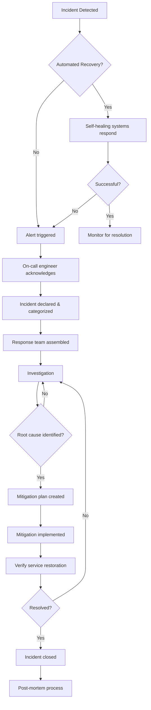

# Incident Response Playbook

This playbook outlines the standard operating procedures for detecting, responding to, and resolving incidents affecting the Ultimate Marketing Team platform.

## Incident Severity Levels

| Level | Description | Examples | Response Time | Resolution Target |
|-------|-------------|----------|---------------|-------------------|
| **P1** | Critical service outage affecting all users. Business-critical functionality unavailable. | - Complete API outage<br>- Database unavailable<br>- All content generation failing | 15 minutes | 4 hours |
| **P2** | Partial service outage affecting significant portion of users or key functionality. | - Specific API endpoints unavailable<br>- Major performance degradation<br>- Content generation delays > 5 minutes | 30 minutes | 8 hours |
| **P3** | Minor service impact affecting small number of users or non-critical functionality. | - Non-critical feature unavailable<br>- Minor performance issues<br>- Intermittent errors for small % of users | 2 hours | 24 hours |
| **P4** | No immediate user impact but requires attention. | - System warnings<br>- Error budget consumption increase<br>- Technical debt issues | 8 hours | 72 hours |

## Incident Response Workflow



## Initial Response (First 15 Minutes)

### 1. Acknowledge the Alert

- Acknowledge alert in PagerDuty or monitoring system
- Join #incident-response channel in Slack
- Start an incident document using the template
- Post initial notification in Slack channel

### 2. Assess Severity and Impact

- Check monitoring dashboards for scope of impact
- Verify which services/features are affected
- Determine approximate number/percentage of users impacted
- Classify incident severity (P1-P4) based on impact assessment

### 3. Declare Incident and Form Response Team

- For P1/P2: Create incident war room in Zoom
- For P1/P2: Page additional responders as needed:
  - Service owner
  - SRE on-call
  - Senior engineering lead
  - Product representative (for customer-facing issues)
- Assign incident roles:
  - Incident Commander (IC)
  - Communication Lead
  - Technical Lead
  - Scribe

### 4. Initial Communication

- Post in #service-status channel for internal awareness
- For P1/P2: Prepare initial customer communication
- Update status page with preliminary information

## Investigation Phase

### 1. Gather Information

- Review recent deployments or changes
- Check correlation with recent alerts
- Analyze logs, metrics, and traces:
  - Elasticsearch/Kibana for logs
  - Prometheus/Grafana for metrics
  - Jaeger for distributed traces
- Check health of dependent services:
  - Database
  - Redis
  - RabbitMQ
  - External APIs

### 2. Create Timeline

Document in chronological order:
- When the incident started
- Any preceding events
- Alert times
- Actions taken so far

### 3. Form Hypotheses

- Brainstorm potential causes
- Prioritize hypotheses based on available evidence
- Document each hypothesis and test plan

### 4. Test Hypotheses

For each hypothesis:
- Determine how to validate or disprove it
- Gather relevant data
- Test carefully, avoiding actions that could worsen the situation
- Document results, including failed hypotheses

## Mitigation Phase

### 1. Develop Mitigation Plan

- Determine fastest way to restore service
- Consider temporary workarounds vs. permanent fixes
- Evaluate risks of proposed solutions
- Document plan with rollback procedure
- Get consensus from technical team

### 2. Implement Mitigation

- Execute the plan with careful monitoring
- Communicate each step in incident channel
- For high-risk changes, consider staged rollout
- Have rollback plan ready

### 3. Verify Resolution

- Confirm service restoration via monitoring
- Test affected functionality
- Verify customer impact has ceased
- Monitor for any side effects

## Resolution Phase

### 1. Confirm Stability

- Monitor key metrics for at least 15 minutes
- Verify that all affected components are stable
- Confirm that error rates have returned to normal levels

### 2. Communication

- Update status page
- Send resolution notification to affected customers
- Update internal stakeholders

### 3. Handoff and Follow-up

- Transfer any ongoing monitoring to regular on-call rotation
- Document any temporary measures that need permanent fixes
- Create follow-up tickets for detailed investigation
- Schedule post-mortem meeting

## Post-Mortem Process

### 1. Schedule Post-Mortem Meeting

- For P1/P2: Schedule within 24-48 hours
- For P3/P4: Schedule within 1 week
- Include all incident responders and service owners

### 2. Complete Post-Mortem Document

Use the [post-mortem template](/docs/incident-management/post-mortem-template.md) to document:
- Incident timeline
- Root cause analysis
- Impact assessment
- Action items to prevent recurrence

### 3. Review Meeting

- Review the incident chronology
- Discuss root cause(s)
- Validate impact assessment
- Identify what went well
- Identify what went wrong
- Agree on action items

### 4. Follow-up

- Publish post-mortem document
- Create JIRA tickets for all action items
- Schedule follow-up meeting to verify actions are completed

## Communication Guidelines

### Internal Updates

- Post regular updates in #incident-response channel
- For extended incidents, update frequency:
  - P1: Every 30 minutes
  - P2: Every hour
  - P3: Every 4 hours
  - P4: Daily

### External Communication

- Update status page within 15 minutes of incident declaration
- Use clear, non-technical language
- Include:
  - Services affected
  - General description of impact
  - Time of detection
  - Status of investigation/resolution
  - Expected time to resolution (if known)
  - Time of next update

## Incident Tools and Resources

### Communication Channels

- Slack: #incident-response and #service-status
- Zoom: Incident war room
- PagerDuty: Escalation and notification

### Monitoring and Diagnostics

- Prometheus/Grafana: Real-time metrics
- Elasticsearch/Kibana: Log analysis
- Jaeger: Distributed tracing
- Healthchecks: /api/v1/health endpoints

### Documentation

- Service architecture diagrams: /docs/architecture
- Runbooks: /docs/runbooks
- Contact information: /docs/on-call-roster.md

## Appendix

### Helpful Commands

#### Checking API Health

```bash
curl https://api.ultimatemarketing.com/api/v1/health
```

#### Checking RabbitMQ Queue Backlog

```bash
rabbitmqctl list_queues name messages messages_unacknowledged
```

#### Restarting API Service

```bash
kubectl rollout restart deployment api
```

#### Viewing Recent Logs

```bash
kubectl logs -l app=api --tail=100
```

### Incident Response Checklist

- [ ] Alert acknowledged
- [ ] Incident declared and severity set
- [ ] Response team assembled
- [ ] Status page updated
- [ ] Investigation underway
- [ ] Root cause identified
- [ ] Mitigation plan created
- [ ] Service restored
- [ ] Communication sent
- [ ] Post-mortem scheduled